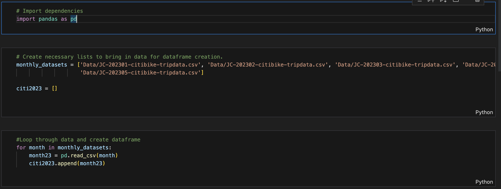
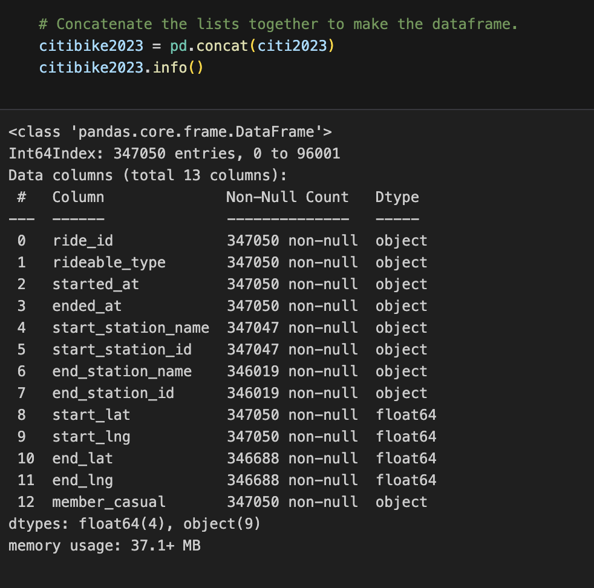
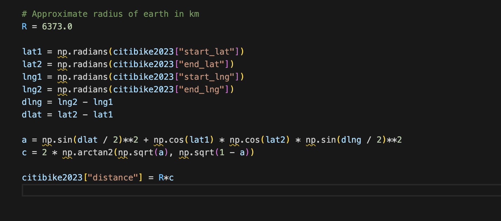

# citibike-challenge

  

## Overview

Congratulations on your new job! As the new lead analyst for the New York Citi BikeLinks to an external site. You are now responsible for overseeing the largest bike-sharing program in the United States. In your new role, you will be expected to generate regular reports for city officials looking to publicize and improve the city program.

Since 2013, the Citi Bike program has implemented a robust infrastructure for collecting data on the program's utilization. Each month, bike data is collected, organized, and made public on the Citi Bike DataLinks to an external site.

However, while the data has been regularly updated, the team has yet to implement a dashboard or sophisticated reporting process. City officials have questions about the program, so your first task on the job is to build a set of data reports to provide the answers.

## Data Collection

In a jupyter notebook, I pulled the different citibike csv files into dataframes and then concatenated them to each other.

Next, I added a column to the dataset to get the distance traveled for each bike ride.

After creating this final column, I read the dataframe into a csv to use in Tableau.

##Data Visualization

