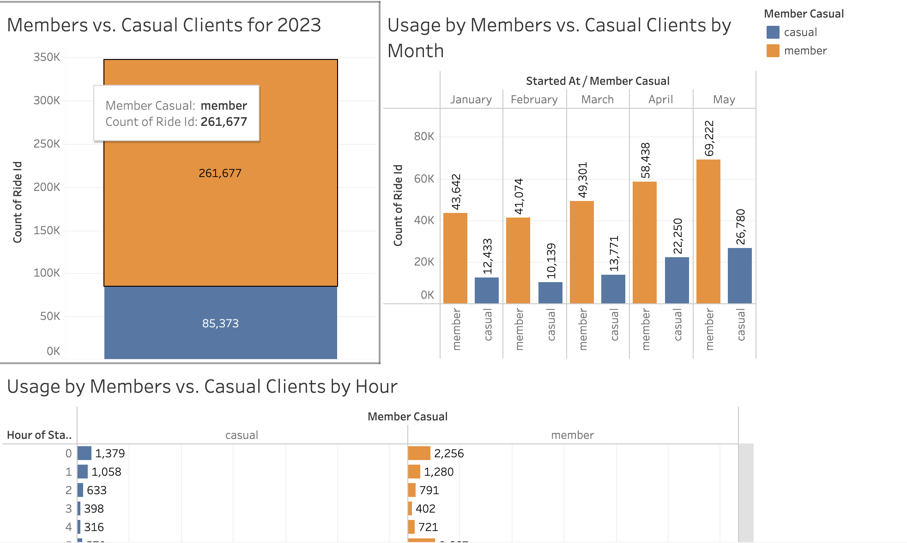
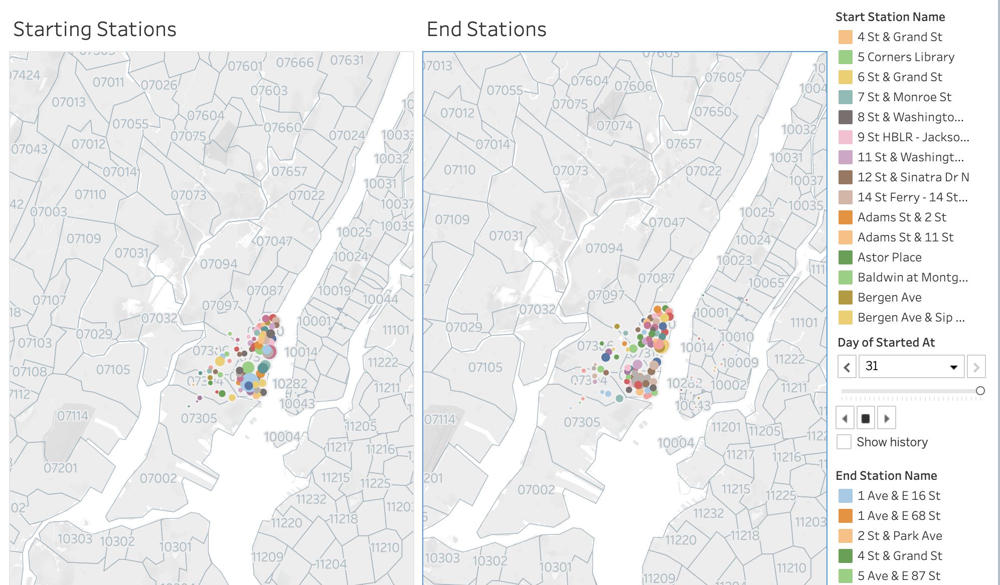

# citibike-challenge

  

## Overview

Congratulations on your new job! As the new lead analyst for the New York Citi BikeLinks to an external site. You are now responsible for overseeing the largest bike-sharing program in the United States. In your new role, you will be expected to generate regular reports for city officials looking to publicize and improve the city program.

Since 2013, the Citi Bike program has implemented a robust infrastructure for collecting data on the program's utilization. Each month, bike data is collected, organized, and made public on the Citi Bike DataLinks to an external site.

However, while the data has been regularly updated, the team has yet to implement a dashboard or sophisticated reporting process. City officials have questions about the program, so your first task on the job is to build a set of data reports to provide the answers.

## Deployment

Please follow the link to the Tableau dashboard, showcasing the results of the analysis:
[Citibike Project](https://public.tableau.com/app/profile/john.miller7271/viz/CitiBikeProject_16886889089780/GrowthofMembershipvs_Casual)

## Data Collection

In a jupyter notebook, I pulled the different citibike csv files into dataframes and then concatenated them to each other. All of my files realte to Jersey City and not New York City.

Next, I added a column to the dataset to get the distance traveled for each bike ride.

After creating this final column, I read the dataframe into a csv to use in Tableau.

## Data Visualization

### Ride Totals for Members vs. Casual

The first dashobard illustrates how Citibike largely services a membership-based clientele. with members using the bikes 3x the amount that casual clients use the bikes. Not surprisingly, the highest usage of bikes occur during commute times.

### Top 25 Start and End Stations

Analyzing the most popular start and end stations for both classic and e-bikes, Citibike would be wise to make sure that the most popular stations have the resources they need because there is direct overlap between the most popular starting stations and ending stations, regardless of the type of bike used.

### Days and Times

Regarding bike usage in Jersey City, the Citibike program can largely be ascribed to a local commuter service, which should be it's first function anyways. The largest usage are weekdays during commute hours, and while there is frequent use on the weekend, they don't match up to the weekdays during rush hour traffic.

### Growth Rate

The Citibike program has grown by all metrics in 2023. We see a slight dip in usage rates in February, which makes sense because that is often the coldest month of the year. One interesting finding though is that e-bike usage drops in late spring, which we speculate has to do with people' desire to use the bikes as a form of exercise as well as transportation.

### Starting and Ending Stations

The last dashboard captures the different starting and ending stations used on a daily basis. The dashboard scrolls each day, changing the size of the circle marker for each station to show how many bikes were used there relative to the other stations.

